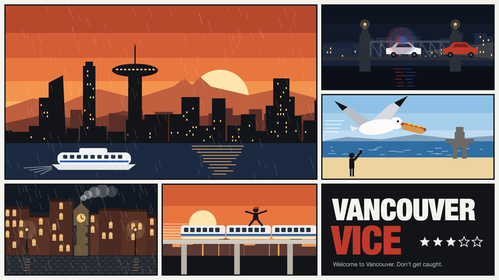

<h1 align="center">Vancouver Vice</h1>

<b>Welcome to Vancouver. Don't get caught.</b>

Rent is four grand and it rains nine months a year. Steal a car on Granville, rob the 7-Eleven, lose the cops on the Burrard Bridge. The more trouble you cause, the more stars you get.

It's the real city: the Unreal build streams Google's 3D scan of Vancouver, so you start outside the actual Apple Store on Georgia. Play as Joshua downtown, Ben in Kits or Alexandre in Victoria, and switch any time.

## Cast
Your family gets pulled in. Brian, your dad, has the garage, the boat, and a thing he wants back: his hard drive. Christine calls at terrible moments. Sarah is smarter than all three of you and refuses to help. Then she's the best one on the job.

| | |
|---|---|
|  |  |

## Play
**[Play in your browser](https://vancouvervice.heyitsmejosh.com)**, on your phone or your computer. Or grab the app for Mac, Windows, Linux, iPhone or Android from [releases](https://github.com/nulljosh/vancouvervice/releases/latest).

## Controls
W A S D to move, Shift to run, Space to jump. Mouse to look, click to shoot, F to punch. E to jack a car, R for the radio. Tab to switch characters. Esc for the menu.

On a phone: stick on the left, drag to look, buttons on the right.

## Benchmarks

Headless, Playwright on swiftshader, 1280x720, Mac Mini M4. Real GPUs run far faster; these are the numbers the tests hold the line on. `node tests/bench.mjs` regenerates them.

| Scene | Boot | Island build | Frames per 10 s |
|---|---|---|---|
| Downtown, OpenStreetMap extrusions only | 8.1 s | | 5 |
| Downtown plus the Granville and Georgia island | 2.5 s | 10.9 s | 5 |

The island is 10 buildings, 84 frontages and 69 tenant signs drawn at start-up from one spec, with no binary assets. The same spec exports an 8.7 MB glTF for Unreal in one headless Blender run.

## Two builds
The browser build plays anywhere. The Unreal build is the real-looking one, Mac only for now, and you can scan your own face in with an iPhone.

---
Apache 2.0 license. Map data © OpenStreetMap contributors. People by Microsoft Rocketbox (MIT). Car model by vicent091036 (CC-BY 4.0). Privacy: [vancouvervice.heyitsmejosh.com/privacy.html](https://vancouvervice.heyitsmejosh.com/privacy.html).

[Changelog](CHANGELOG.md) · [Roadmap](roadmap.md) · [How it works](docs/ARCHITECTURE.md) · [Contributing](CONTRIBUTING.md) · [Security](SECURITY.md)
